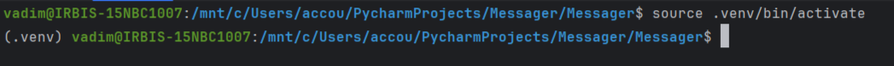

<h1>Server_3_free_threads</h1> 

The WSGI server is based on threads,  
which began with experiments on sockets.

<h3 class="none" style="color: red;">Important!</h3>
It is supported only on Linux 2.5.44 and later

<ol><h3>the server uses four threads:</h3>
    <li><b>accepting_connections</b>, to accept connections</li>
    <li><b>reading_from_socket</b>, to read data from a client socket</li>
    <li><b>sending_to_socket</b>, to send data to a socket</li>
    <li><b>close_client_sock</b>, to close client sockets</li>
</ol>

<h3 class="none" style="color: yellow;">Note</h3>
It is recommended to use a python 3.13 or later 
build from the source code, with the GIL disabled,  
to improve performance

<h2>Quick start</h2> 

<h3>log in to your project folder</h3>

[//]: # (![Картинка][2])

<h3>activate the virtual environment</h3>

install the library with the command: 
*pip install server-3-free-threads*

[1]: https://docs.python.org/3/whatsnew/3.13.html#whatsnew313-free-threaded-cpython "Free-threaded CPython"
[2]: img/1.1.png
[3]: img/1.2.png
[4]: img/2.1.png