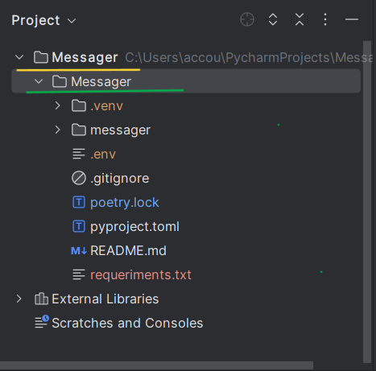
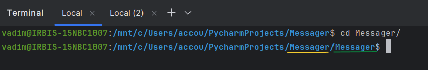

# Server_3_free_threads
the project appeared as a result of experiments on sockets.  
This is a WSGI server based on threads

 

***
### *

Important!

*
*It is supported only on Linux 2.5.44 and later*
***

 

## the server uses four threads:
1.<b>accepting_connections</b>, to accept connections 
2.<b>reading_from_socket</b>, to read data from a client socket 
3.<b>sending_to_socket</b>, to send data to a socket 
4.<b>close_client_sock</b>, to close client sockets 

 

***
### *
Note
*
*It is recommended to use a python 3.13 or later 
build from the source code, with the GIL disabled,  
to improve performance*
***

 

## Quick start

### log in to your project folder

<h3>activate the virtual environment</h3>

install the library with the command: 
pip install server-3-free-threads

